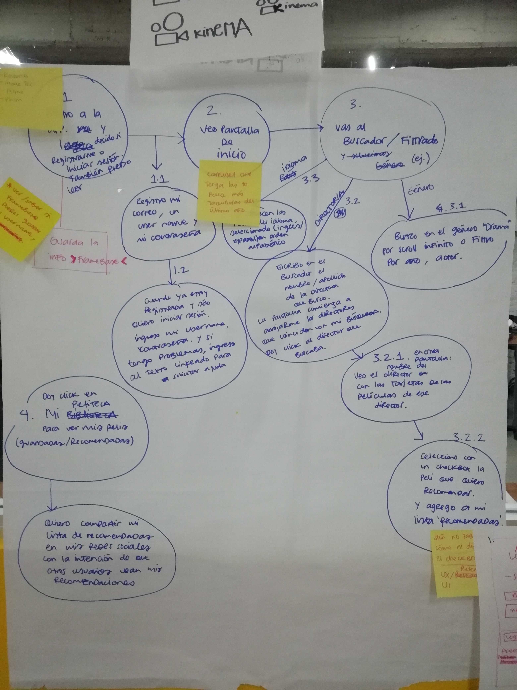
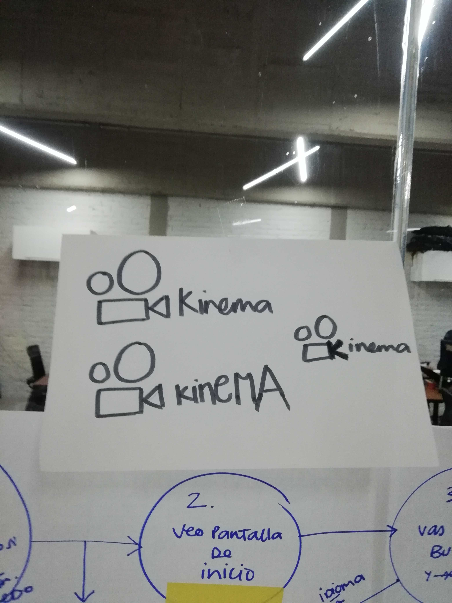
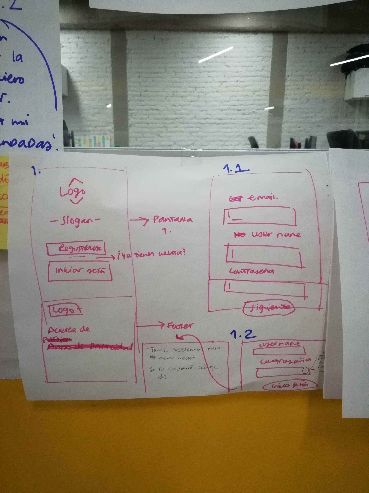
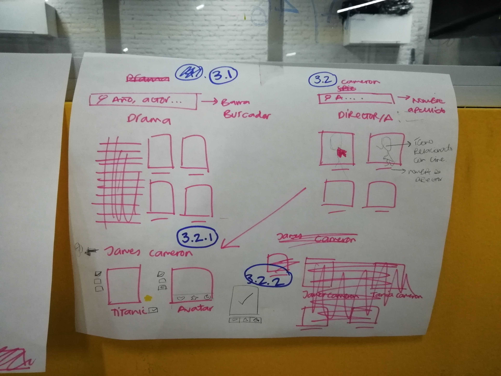
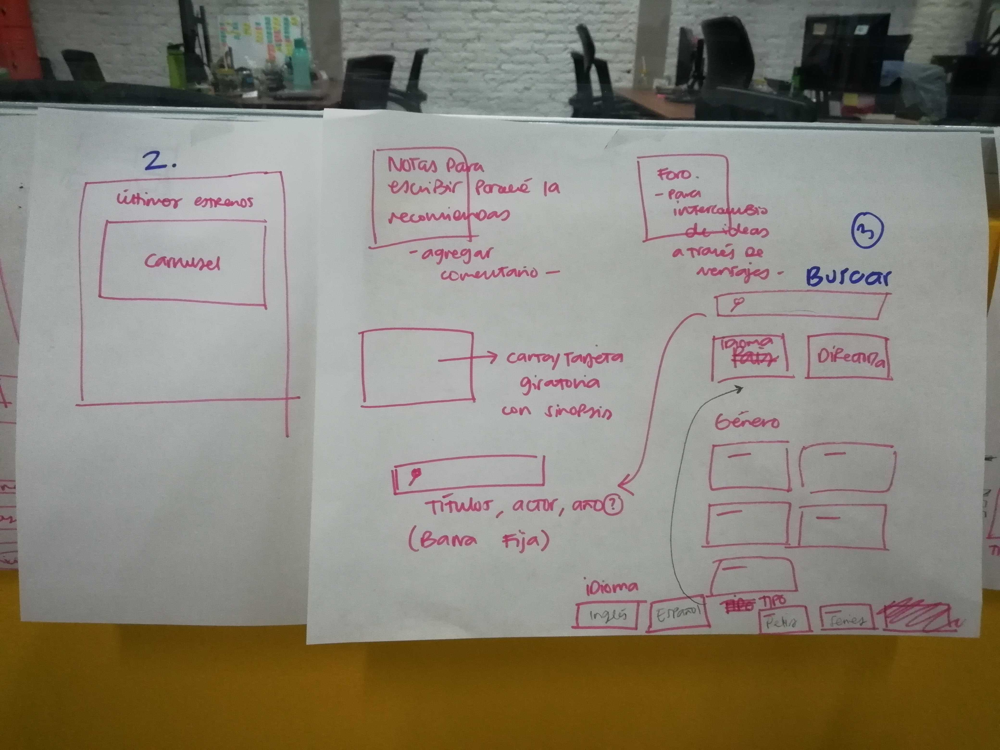

# Kineteca
## Índice

- [Preámbulo](#preámbulo)
- [Descripción](#resumen-del-proyecto)
- [Definición del producto](#definición-del-producto)

---

## Preámbulo

El streaming es un concepto utilizado para definir una forma de consumir contenido a través de la red sin la necesidad de tener que descargarlo. Se trata de utilizar la tecnología y las redes para emitir contenido almacenado en la nube en dispositivos como ordenadores, smartphones y tablets a la vez que se visualiza.

En la actualidad existen multitud de portales destinados a emitir contenido anónimo, de empresas y de particulares, tanto en directo como en diferido.

El contenido que se consume vía streaming es, en su práctica totalidad, música y vídeo, si bien, también podemos encontrar documentos de texto, pdfs, diapositivas y un largo etcétera. Todo lo que podamos crear lo podemos distribuir de esta manera, incluyendo ya partidos de fútbol, mítines, reuniones, eventos con celebridades…

## Resumen del proyecto

En este proyecto **se construyó una _página web_ para visualizar un
_conjunto (set) de datos_** que se adecúo a lo que descubrimos que nuestro usuario
necesitaba.

Una vez que definimos nuestra área de interés, entiendimos quién es nuestro usuario y qué necesitabamos saber o ver exactamente, posteriormente construimos la interfaz que le ayudó a interactuar y entender mejor esos datos.
Como entregable final tenemos una página web que permite **visualizar la data,
filtrarla, ordenarla y hacer algún cálculo agregado**.

## Definición del producto
### Contextualización del Proyecto
Hoy en día se cuenta con diversas plataformas en las cuales se puede visualizar películas vía streaming como lo son Netflix o Blim, lo cuál no permite observar gran variedad de películas en cualquier lugar donde tengamos dispositivos e internet.

Kineteca es una aplicación que ayuda al usuario a tener una biblioteca con recomendaciones de otras personas que cuenten con la aplicación y así mismo el mismo usuario puede realizar recomendaciones a otros usuarios a través de su perfil de una manera más accesible y dinámica sin que un usuario tenga acceso a las películas que ya ha visto anteriormente o sitios que ha visitado com sucede en Netflix que al compartir tu cuenta otras personas pueden acceder a tus películas ya observadas e incluso recomendacones porque ya viste ciertas películas. Esta aplicación tiene una biblioteca cerca de 1,000 películas a las cuales puede acceder el usuario y agregar a su lista de recomendados.

### Historias de usuario

1.- Yo como USUARIO quiero poder visualizar las películas que se han estrenado en el último año.

    -Criterios de Aceptación:

    PANTALLA DE INICIO: En caso de que el usuario al ingresar a nuestra página pueda obrservar de manera dinámica las películas más taquilleras del último año, mostrando elementos relacionados con la película.

### Diseño de la Interfaz de Usuario

Nuestra aplicación tiene como punto focal la asociación que se tiene con un estili minimalista y neutro para mantener una interfaz limpia para mantener la atención de los USUARIOS en las películas.

#### LOGO

#### Prototipo de baja fidelidad

#### Prototipo de alta fidelidad
Dentro del proyecto realizamos FIRST_MOBILE: [Mobile](https://www.figma.com/proto/R3HlQy9b2gF2k5H7m1kr3ZqW/Untitled?node-id=26%3A179&scaling=scale-down&redirected=1)
